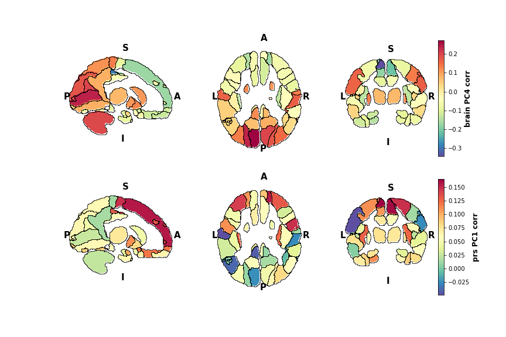

# Examining neuroimaging markers related to psychiatric disorders in neonates using diffusion MRI and machine learning

One of the biggest challenges in the field of psychiatry is the inconsistent diagnoses, which are primarily done based on individual behavioural symptoms. This is exarcebated when there is overlapping in behavioural manifestations between several disorders. Current treatments also appear very limited, as there is a big gap in our understanding of the biological underpinning of such disorders. Recent research suggest many of the psychiatric disorders may have early life origins, i.e. disruption to early brain developmental processes either through environmental and/or genetic factors predispose one's brain to become schizophrenic, ASD, etc. If this is the case, then we may design treatments targeted at these early time windows, long before the original onset of such disorders.

My PhD project aims to address both of these questions. 1) Can we identify a **neuroimaging marker** specific to schizophrenia or ASD in babies, long before the average age of onset of such diseases and 2) Can we learn something about the **early biological underpinning** that may contribute to these diseases?

<!-- Images  -->

<!--- 



 --->